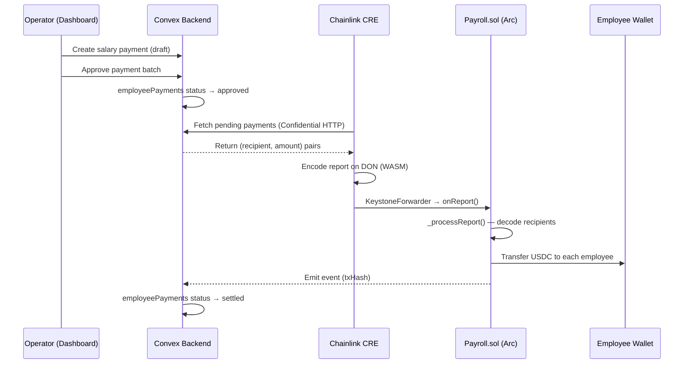
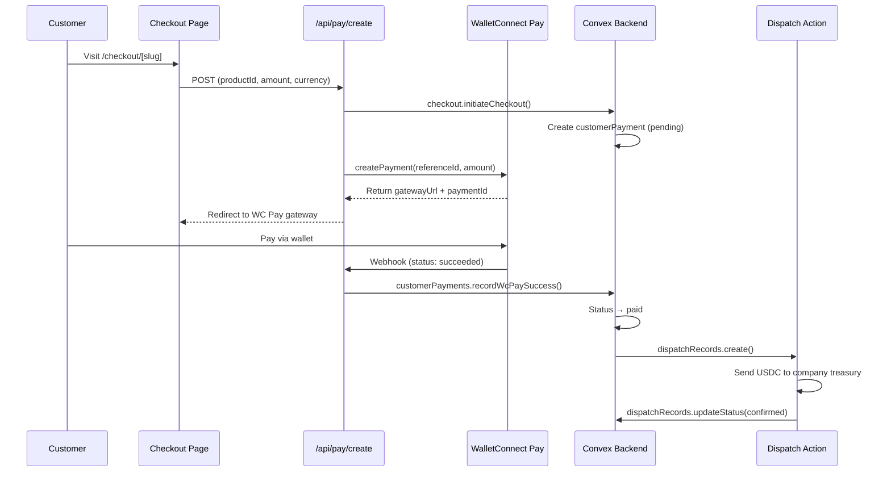
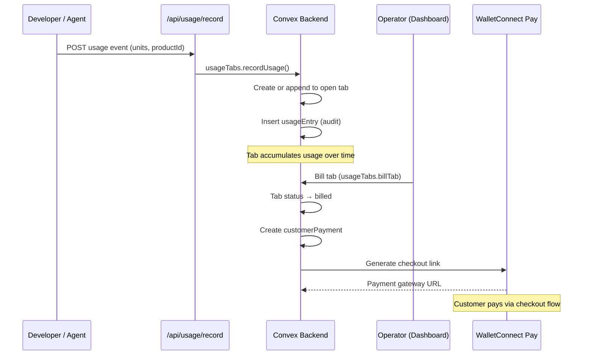
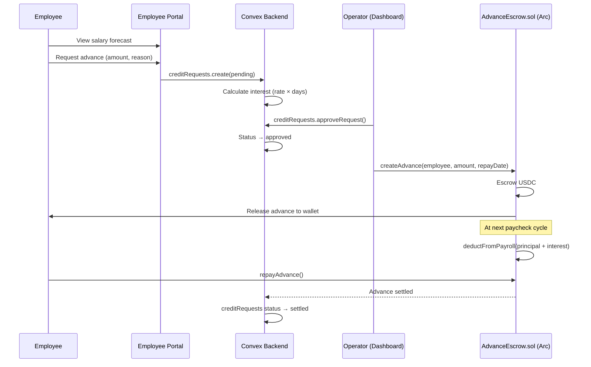
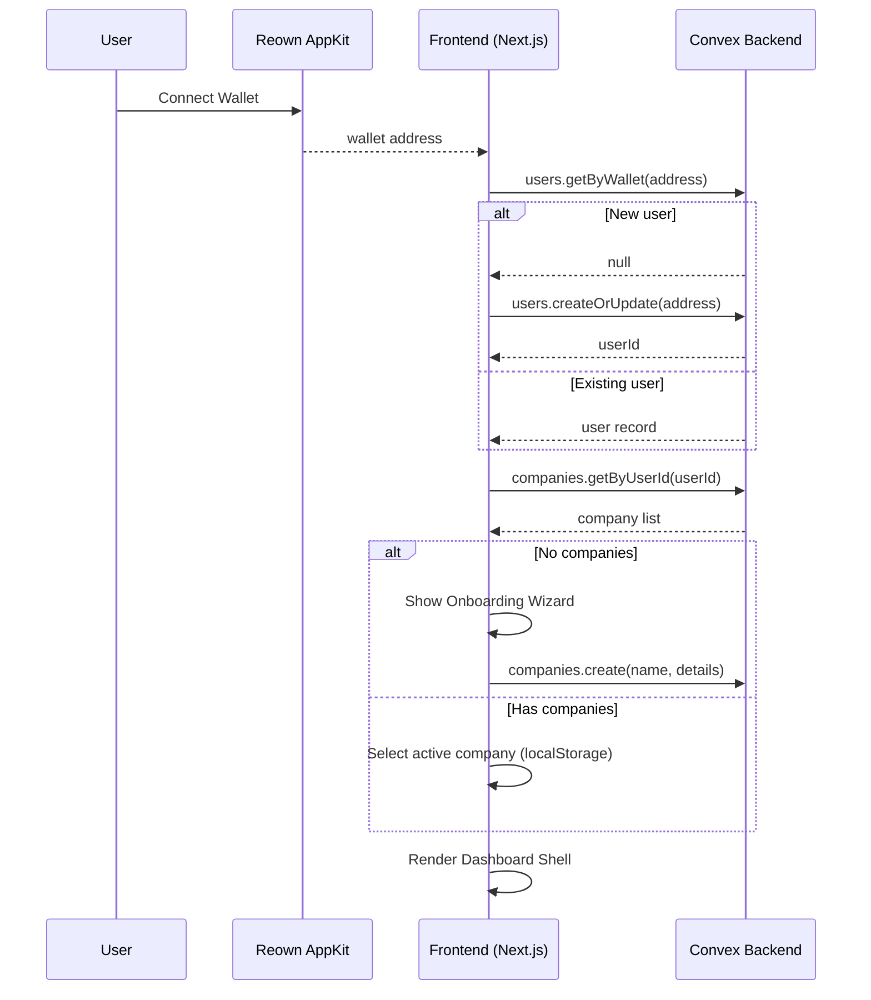

# Arc Counting — Architecture Diagram

## System Architecture

```mermaid
graph TB
    subgraph Client["Frontend — Next.js 16 + React 19"]
        Landing["Landing Page<br/>(/)"]
        Dashboard["Dashboard Shell<br/>/(wallet)/dashboard/*"]
        Checkout["Public Checkout<br/>/checkout/[slug]"]
        EmployeePortal["Employee Portal<br/>/(wallet)/employee-portal"]
        Admin["Admin Panel<br/>/admin"]

        subgraph Providers["Client Providers"]
            Reown["Reown AppKit<br/>(Wallet Auth)"]
            WagmiProvider["Wagmi + viem<br/>(Chain Interaction)"]
            ConvexClient["Convex Client<br/>(Real-time Queries)"]
            ReactQuery["React Query<br/>(Server State)"]
        end

        subgraph UILayer["UI Layer"]
            ShadcnUI["shadcn/ui Components"]
            TailwindCSS["TailwindCSS 4"]
            Lucide["Lucide + Hugicons"]
        end

        subgraph Pages["Dashboard Pages"]
            Overview["Overview<br/>(Stats & Alerts)"]
            Employees["Employees<br/>(Outbound Payroll)"]
            Customers["Customers<br/>(Inbound Billing)"]
            Products["Products & SDK<br/>(Checkout Links)"]
            Payroll["Payroll Desk<br/>(Payments & Advances)"]
            Treasury["Treasury<br/>(Balances & Ledger)"]
            AIChat["AI Chat<br/>(Claude Assistant)"]
            AIInsights["AI Insights<br/>(Analytics)"]
            Agents["Agent Keys<br/>(API Management)"]
            Settings["Settings<br/>(Company Config)"]
        end
    end

    subgraph APIRoutes["API Routes — Next.js Server"]
        PayCreate["/api/pay/create"]
        PayStatus["/api/pay/status"]
        PayWebhook["/api/pay/webhook"]
        UsageRecord["/api/usage/record"]
        UsageBill["/api/usage/bill"]
        UsageTab["/api/usage/tab"]
        AIChatRoute["/api/ai/chat"]
        AIAnalyze["/api/ai/analyze"]
        AgentKeys["/api/agent/keys"]
        AgentSession["/api/agent/session"]
    end

    subgraph ConvexBackend["Backend — Convex Serverless"]
        subgraph Queries["Queries (Read-only)"]
            QUsers["users.getByWallet"]
            QCompanies["companies.getByUserId"]
            QEmployees["employees.listByCompany"]
            QCustomers["customers.listByCompany"]
            QProducts["products.listByCompany"]
            QPayments["customerPayments.list*"]
            QBalances["balances.getForCompany"]
            QOverview["overview.stats"]
            QAdvances["creditRequests.list*"]
        end

        subgraph Mutations["Mutations (State-changing)"]
            MUsers["users.createOrUpdate"]
            MCompanies["companies.create/update"]
            MEmployees["employees.create/update"]
            MCustomers["customers.create/update"]
            MProducts["products.create/update"]
            MPayments["payments.create/settle"]
            MBalances["balances.credit/debit"]
            MCheckout["checkout.initiate/confirm"]
            MAdvances["creditRequests.approve/deny"]
            MUsage["usageTabs.recordUsage"]
        end

        subgraph Actions["Actions (Server-side)"]
            Dispatch["dispatch.dispatchAll<br/>(Send USDC)"]
            CRETrigger["cre.triggerPayroll<br/>(Chainlink CRE)"]
            Crons["crons.*<br/>(Scheduled Jobs)"]
            Seed["seed.*<br/>(Demo Data)"]
        end

        subgraph Schema["Database — 22 Tables"]
            subgraph Identity["Identity & Access"]
                TUsers["users"]
                TCompanyMembers["companyMembers"]
                TCompanies["companies"]
                TOnboarding["onboardingState"]
            end
            subgraph OutboundPayroll["Outbound Payroll"]
                TEmployees["employees"]
                TCompLines["compensationLines"]
                TCompSplits["compensationSplits"]
                TEmpPayments["employeePayments"]
                TCreditReq["creditRequests"]
                TCreditSettings["creditSettings"]
            end
            subgraph InboundBilling["Inbound Billing"]
                TCustomers["customers"]
                TProducts["products"]
                TCheckoutLinks["checkoutLinks"]
                TCustPayments["customerPayments"]
                TUsageTabs["usageTabs"]
                TUsageEntries["usageEntries"]
            end
            subgraph FinanceLayer["Finance & Settlement"]
                TBalances["companyBalances"]
                TBalEntries["balanceEntries"]
                TDispatch["dispatchRecords"]
            end
            subgraph AIAgentTables["AI & Agent"]
                TAIChat["aiChatSessions"]
                TAIInsights["aiInsightRequests"]
                TAIBills["aiUsageBills"]
                TAgentKeys["agentApiKeys"]
                TAgentSessions["agentSessions"]
                TAgentSettle["agentSettlements"]
            end
        end
    end

    subgraph Blockchain["Blockchain Layer"]
        subgraph ArcTestnet["Arc Testnet (Chain 5042002)"]
            PayrollContract["Payroll.sol<br/>(CRE-triggered salary)"]
            AdvanceEscrow["AdvanceEscrow.sol<br/>(Salary advance escrow)"]
            USDC_Arc["USDC on Arc"]
            EURC_Arc["EURC on Arc"]
        end
        subgraph OtherChains["Settlement Bridges"]
            ArbitrumSepolia["Arbitrum Sepolia"]
            BaseSepolia["Base Sepolia"]
        end
    end

    subgraph ExternalAPIs["External Services"]
        WCPay["WalletConnect Pay<br/>(Checkout Payments)"]
        ChainlinkCRE["Chainlink CRE<br/>(Payroll Automation)"]
        CircleCCTP["Circle CCTP v2<br/>(Cross-chain Bridge)"]
        AnthropicAI["Anthropic Claude<br/>(AI Assistant)"]
        ReownAuth["Reown AppKit<br/>(Wallet Auth)"]
    end

    %% Frontend connections
    Landing -->|Connect Wallet| Reown
    Dashboard --> Pages
    Dashboard --> Providers
    Pages --> UILayer

    %% Client to API
    Dashboard -->|HTTP/JSON| APIRoutes
    Checkout -->|HTTP/JSON| PayCreate
    EmployeePortal -->|Convex hooks| ConvexBackend

    %% Client to Convex (real-time)
    ConvexClient -->|WebSocket| Queries
    ConvexClient -->|WebSocket| Mutations

    %% API to external
    PayCreate -->|REST| WCPay
    PayWebhook -->|Webhook| WCPay
    AIChatRoute -->|Streaming| AnthropicAI
    AIAnalyze -->|REST| AnthropicAI

    %% API to Convex
    APIRoutes -->|ConvexHttpClient| Mutations

    %% Convex to Blockchain
    Dispatch -->|viem + RPC| ArbitrumSepolia
    Dispatch -->|viem + RPC| BaseSepolia
    CRETrigger -->|Confidential HTTP| ChainlinkCRE
    ChainlinkCRE -->|onReport()| PayrollContract

    %% Blockchain cross-chain
    CircleCCTP -->|Burn/Mint| ArcTestnet
    CircleCCTP -->|Burn/Mint| ArbitrumSepolia
    CircleCCTP -->|Burn/Mint| BaseSepolia

    %% Wallet interaction
    WagmiProvider -->|RPC| ArcTestnet
    WagmiProvider -->|Read/Write| PayrollContract
    WagmiProvider -->|Read/Write| AdvanceEscrow

    %% Auth flow
    Reown -->|Wallet Address| ReownAuth

    %% Styling
    classDef frontend fill:#e0f2fe,stroke:#0284c7,color:#0c4a6e
    classDef api fill:#fef3c7,stroke:#d97706,color:#78350f
    classDef backend fill:#d1fae5,stroke:#059669,color:#064e3b
    classDef blockchain fill:#ede9fe,stroke:#7c3aed,color:#3b0764
    classDef external fill:#fce7f3,stroke:#db2777,color:#831843
    classDef db fill:#f0fdf4,stroke:#16a34a,color:#14532d

    class Landing,Dashboard,Checkout,EmployeePortal,Admin,Overview,Employees,Customers,Products,Payroll,Treasury,AIChat,AIInsights,Agents,Settings frontend
    class Reown,WagmiProvider,ConvexClient,ReactQuery,ShadcnUI,TailwindCSS,Lucide frontend
    class PayCreate,PayStatus,PayWebhook,UsageRecord,UsageBill,UsageTab,AIChatRoute,AIAnalyze,AgentKeys,AgentSession api
    class QUsers,QCompanies,QEmployees,QCustomers,QProducts,QPayments,QBalances,QOverview,QAdvances backend
    class MUsers,MCompanies,MEmployees,MCustomers,MProducts,MPayments,MBalances,MCheckout,MAdvances,MUsage backend
    class Dispatch,CRETrigger,Crons,Seed backend
    class TUsers,TCompanyMembers,TCompanies,TOnboarding,TEmployees,TCompLines,TCompSplits,TEmpPayments,TCreditReq,TCreditSettings db
    class TCustomers,TProducts,TCheckoutLinks,TCustPayments,TUsageTabs,TUsageEntries,TBalances,TBalEntries,TDispatch db
    class TAIChat,TAIInsights,TAIBills,TAgentKeys,TAgentSessions,TAgentSettle db
    class PayrollContract,AdvanceEscrow,USDC_Arc,EURC_Arc,ArbitrumSepolia,BaseSepolia blockchain
    class WCPay,ChainlinkCRE,CircleCCTP,AnthropicAI,ReownAuth external
```

## Data Flow Diagrams

### Payroll Settlement Flow (Outbound)



### Customer Payment Flow (Inbound)



### Usage-Based Billing Flow



### Salary Advance Flow



### Authentication & Workspace Resolution



## Technology Stack

| Layer | Technology | Role |
|-------|-----------|------|
| **Frontend** | Next.js 16, React 19, TypeScript | Full-stack web framework |
| **UI** | TailwindCSS 4, shadcn/ui, Radix UI | Component library & styling |
| **Wallet** | Reown AppKit, Wagmi, viem | Wallet connection & on-chain interaction |
| **Backend** | Convex (serverless) | Real-time database, queries, mutations, actions |
| **Blockchain** | Arc Testnet (Solidity, Foundry) | Smart contracts for payroll & advances |
| **Payments** | WalletConnect Pay | Customer checkout & USDC settlement |
| **Automation** | Chainlink CRE | Scheduled on-chain payroll execution |
| **Bridging** | Circle CCTP v2 | Cross-chain USDC/EURC transfers |
| **AI** | Anthropic Claude, Vercel AI SDK | Dashboard assistant & analytics |
| **Validation** | Zod | Schema-based input validation |
