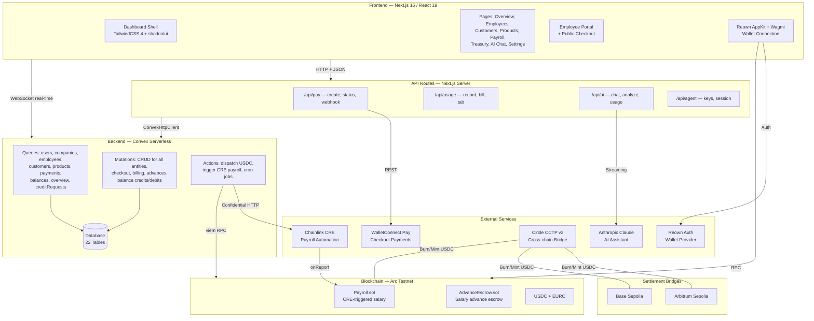
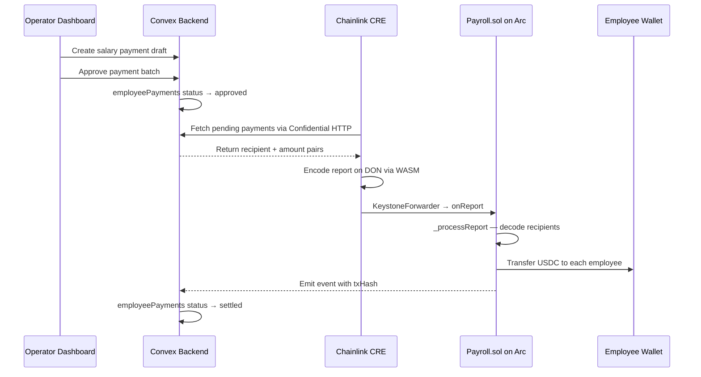
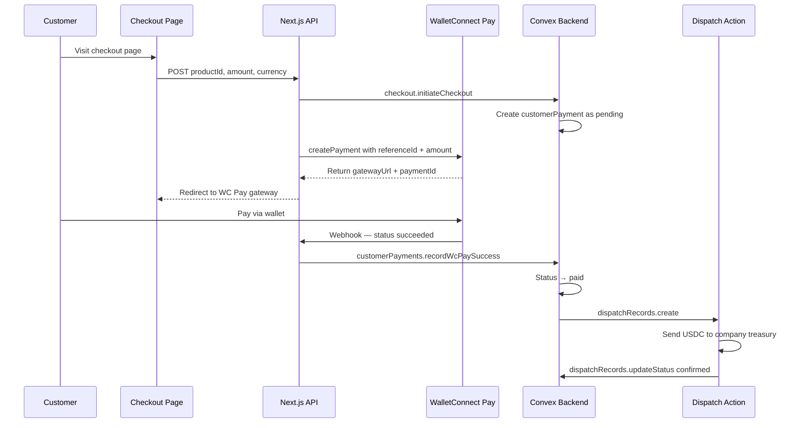
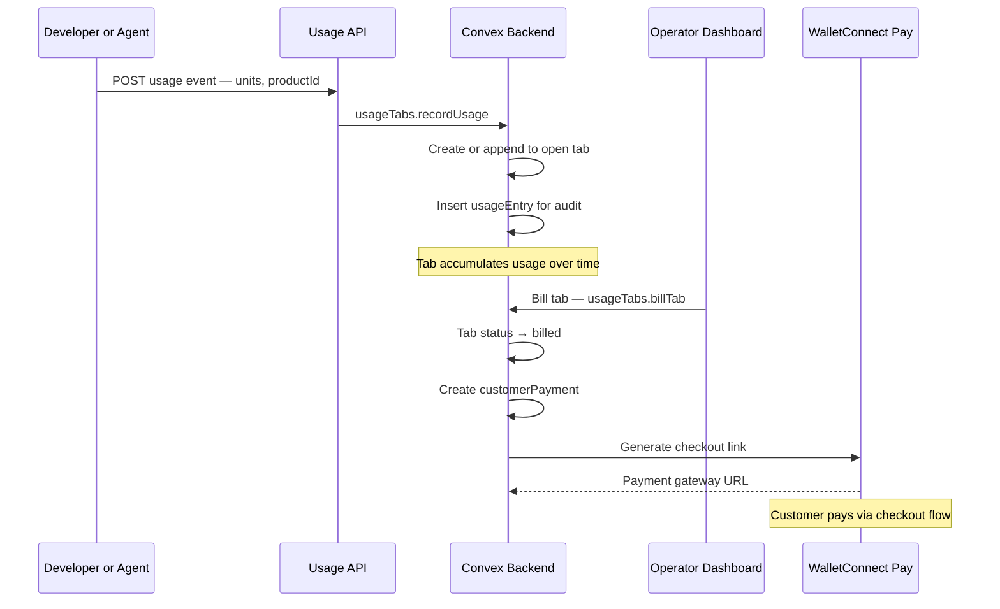
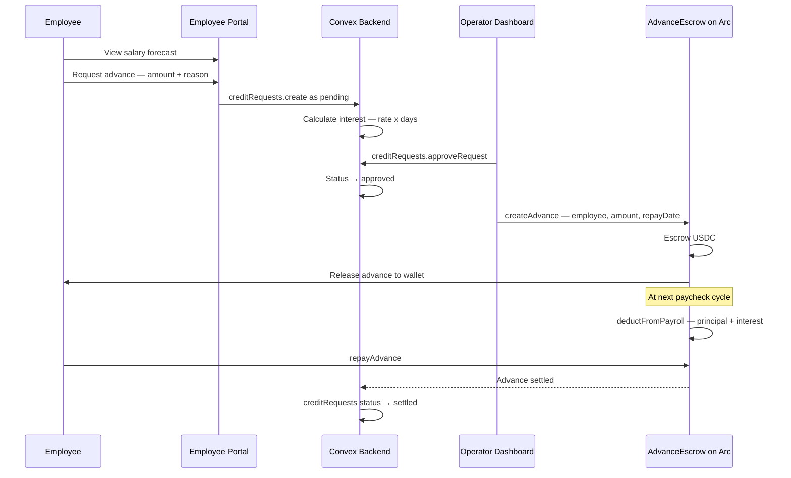
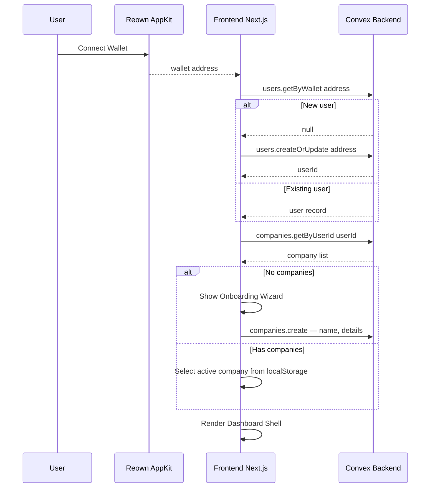
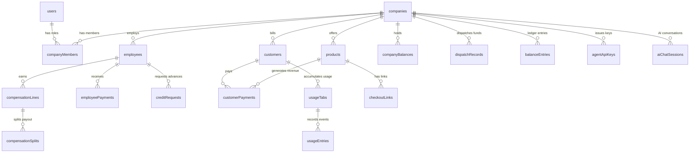

# Arc Counting — Architecture Diagram

## System Architecture

## Data Flow Diagrams

### Payroll Settlement Flow — Outbound

### Customer Payment Flow — Inbound

### Usage-Based Billing Flow

### Salary Advance Flow

### Authentication and Workspace Resolution

## Database Schema Overview

## Technology Stack

| Layer | Technology | Role |
|-------|-----------|------|
| **Frontend** | Next.js 16, React 19, TypeScript | Full-stack web framework |
| **UI** | TailwindCSS 4, shadcn/ui, Radix UI | Component library and styling |
| **Wallet** | Reown AppKit, Wagmi, viem | Wallet connection and on-chain interaction |
| **Backend** | Convex serverless | Real-time database, queries, mutations, actions |
| **Blockchain** | Arc Testnet, Solidity, Foundry | Smart contracts for payroll and advances |
| **Payments** | WalletConnect Pay | Customer checkout and USDC settlement |
| **Automation** | Chainlink CRE | Scheduled on-chain payroll execution |
| **Bridging** | Circle CCTP v2 | Cross-chain USDC/EURC transfers |
| **AI** | Anthropic Claude, Vercel AI SDK | Dashboard assistant and analytics |
| **Validation** | Zod | Schema-based input validation |
